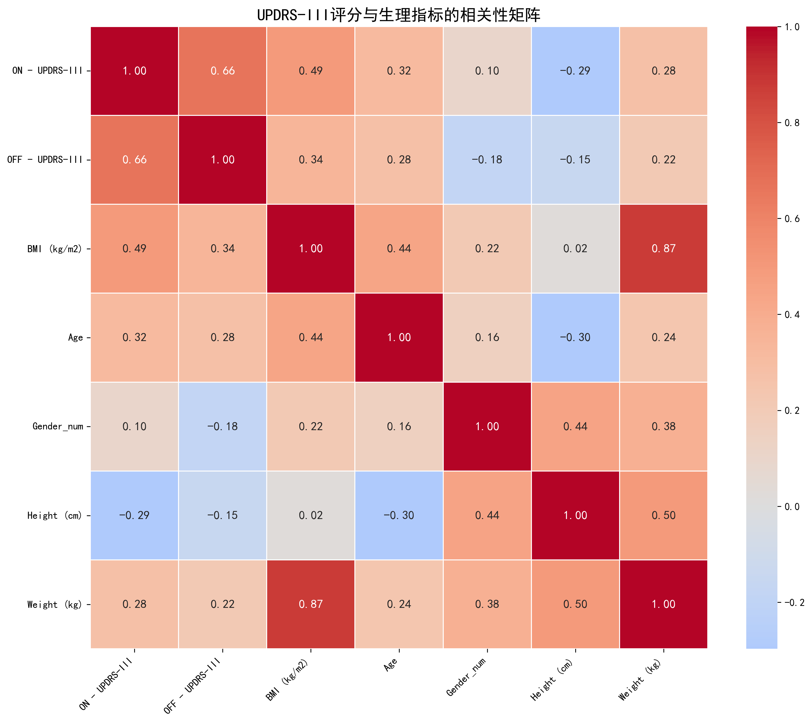

# 因果建模主要方法/约束

[此文件](model/CausalModeling_counterfactual.py)的CounterfactualCausalModeling类。


## 双编码器
此思路参考[GAITGen: Disentangled Motion-Pathology Impaired Gait Generative Model –Bringing Motion Generation to the Clinical Domain](https://arxiv.org/abs/2503.22397)一文所采用的动作和病理特征的解耦。

```python
self.disease_encoder = MLPEncoder(
            input_dim=input_dim,
            hidden_dim=hidden_dim,
            output_dim=z_dim,
            num_layers=3,
            dropout=0.1
        )

self.confound_encoder = MLPEncoder(        
    input_dim=input_dim,
    hidden_dim=hidden_dim,
    output_dim=z_dim,
    num_layers=3,
    dropout=0.1
)

-----以下是forward逻辑-------

z_g = self.disease_encoder(features)  # [B, z_dim]
z_c = self.confound_encoder(features)   # [B, z_dim]
```


### 病理特征`z_g`

#### 处理

```python
z_g_pooled = z_g.mean(dim=(1, 2))
logits = self.regressor(z_g_pooled)  # [B, K-1]
```

这里的regressor是一个**序回归头**，将`z_g`送入其中得到输出。

为啥我改用序回归头而非原本的分类头，理由是：

1. 我认为这里标签（医学评分）具有**顺序性**，2被误诊为0的惩罚应当比被误诊为1的惩罚更高。希望采用这种有顺序的回归可以让它准确性更高
2. 目前模型中的主要问题出现在类别2的准确率低，最好的情况下也在0.3几，接近随机分类

因此我希望通过使用回归头来提高类别2的准确率，以此达到提高总的分类准确率的目标。


#### 约束条件：回归损失

目标是让`z_g`能够准确预测疾病标签。


它的损失函数，我是这样写的（在[这个文件](0822_CausalModeling.py)中）：
```python
def coral_loss(logits, labels, num_classes):
    """
    基于累积概率思想：
    对于K个类别，我们训练K-1个二分类器
    每个二分类器回答：'严重程度是否超过阈值j？'
    """
    target = torch.zeros(labels.size(0), num_classes - 1, device=labels.device)
    for j in range(1, num_classes):
        target[:, j-1] = (labels >= j).float()  # 累积指示函数
    
    # 这建模了 P(severity ≥ j) 的累积概率
    return F.binary_cross_entropy_with_logits(logits, target)
```

```
coral_loss(outputs["logits"], y, num_classes)
```


只提取这个z_g以及采用序回归跑出来的结果：

```python
==========BEST REPORTS============
              precision    recall  f1-score   support

           0       0.60      0.65      0.63      1026
           1       0.45      0.50      0.48       828
           2       0.21      0.12      0.16       486

    accuracy                           0.49      2340
   macro avg       0.42      0.43      0.42      2340
weighted avg       0.46      0.49      0.47      2340


==========BEST REPORTS============
              precision    recall  f1-score   support

           0       0.67      0.72      0.69      1026
           1       0.51      0.44      0.47       828
           2       0.26      0.28      0.27       486

    accuracy                           0.53      2340
   macro avg       0.48      0.48      0.48      2340
weighted avg       0.53      0.53      0.53      2340

```

相比于没有改序回归略有下降，2的类别准确率也没有明显提高。

这里考虑**可能是序回归的实现问题**？


### 混淆特征`z_c`


#### 处理

```python
z_c_pooled = z_c.mean(dim=(1, 2))     # 进行时间和关节维度上的池化
rev_zc=grad_reverse(z_c_pooled,lambd=1.0)

confound_logits=self.regressor(rev_zc)		#和z_g分支用的是同一个回归头

```


参考[GAITGen: Disentangled Motion-Pathology Impaired Gait Generative Model –Bringing Motion Generation to the Clinical Domain](https://arxiv.org/abs/2503.22397)一文所采用的梯度反转GRL，即在反向传播的时候让梯度符号反转；以此确保`z_c`中不包含病理信息。

代码如下：

```python
class GradReverse(Function):
    @staticmethod
    def forward(ctx, x, lambd=1.0):
        ctx.lambd = lambd
        return x.view_as(x)     # 前向传播不变
    @staticmethod
    def backward(ctx, grad_output):
        return grad_output.neg() * ctx.lambd, None      # 反向传播时，接收到来自预测器的梯度，然后取反并且乘上系数lambd

def grad_reverse(x, lambd=1.0):
    return GradReverse.apply(x, lambd)
```


#### 约束：混淆损失+重构损失

混淆损失：

```python
confound_disease_loss = F.cross_entropy(confound_logits, y)
```

这个损失会被梯度反转"反转"其效果。


同时加入了重构损失，以避免信息退化，具体来说是通过一个decoder确保`z_g`和`z_c`拼接起来之后能“重构”原特征。

```python
recon_in = torch.cat([z_g,z_c], dim = -1)       #在C维度上进行拼接
recon_features = self.decoder(recon_in)     #进行decoder解码


-------
# 3.重构对应的重构损失
recon_loss = lambd2 * F.mse_loss(
    outputs["recon_features"].mean(dim=(1, 2)),
    outputs["original_features"].mean(dim=(1, 2))
)
```


-----


#### 预测显式定义的混淆变量的方法

这里还尝试用了预测显式定义的混淆变量（与[gaitscm](https://www.sciencedirect.com/science/article/pii/S1077314224000766)采用的方法类似），分别预测五个标签：`年龄`,`性别`,`身高`,`体重`,`BMI`：

```python
self.age_predictor = nn.Sequential(
            nn.Linear(z_dim, hidden_dim),
            nn.ReLU(),
            nn.Linear(hidden_dim, 1)  # age is a continuous variable
)
self.gender_predictor = nn.Sequential(
    nn.Linear(z_dim, hidden_dim),
    nn.ReLU(),
    nn.Linear(hidden_dim, 2)  # gender is a binary variable (0 or 1)
)
# Add other predictors as needed for height, weight, BMI
self.bmi_predictor = nn.Sequential(
    nn.Linear(z_dim, hidden_dim),
    nn.ReLU(),
    nn.Linear(hidden_dim, 1)
)

self.height_predictor = nn.Sequential(
    nn.Linear(z_dim, hidden_dim),
    nn.ReLU(),
    nn.Linear(hidden_dim, 1)
)

self.weight_predictor = nn.Sequential(
    nn.Linear(z_dim, hidden_dim),
    nn.ReLU(),
    nn.Linear(hidden_dim, 1)
)

-------forward逻辑-------

#各个混淆变量的预测结果
age_preds = self.age_predictor(rev_zc)
gender_preds = self.gender_predictor(rev_zc)
bmi_preds = self.bmi_predictor(rev_zc)
height_preds=self.height_predictor(rev_zc)
weight_preds=self.weight_predictor(rev_zc)
        

    
-------相应的损失函数--------
confound_losses = []
 age_loss = F.mse_loss(outputs["age_preds"].squeeze(), age_data.float())
confound_losses.append(age_loss)
# Gender prediction loss (CrossEntropy)
gender_loss = F.cross_entropy(outputs["gender_preds"], gender_data.long())
confound_losses.append(gender_loss)
# BMI prediction loss (MSE)
bmi_loss = F.mse_loss(outputs["bmi_preds"].squeeze(), bmi_data.float())
confound_losses.append(bmi_loss)
height_loss = F.mse_loss(outputs["height_preds"].squeeze(),height_data.float())
confound_losses.append(height_loss)
weight_loss = F.mse_loss(outputs["weight_preds"].squeeze(),weight_data.float())
confound_losses.append(weight_loss)
```

替换掉上面的混淆损失，但是效果很差，下降了接近0.1，最终f1-accuracy在0.42~0.44左右。


## 干预方法/约束

这里参考的是[gaitscm](https://www.sciencedirect.com/science/article/pii/S1077314224000766)类似的方法，不过交换的是**病理特征**而非像它一样交换混淆特征。

具体做法是：在batch内随机打乱，将打乱之后的样本的`z_g`提取出来，送入regressor进行预测，约束要求预测结果接近给出者的标签。

```python

counterfactual_logits=None
shuffle_idx=None
if labels is not None:
    B = z_g_pooled.shape[0]
    shuffle_idx = torch.randperm(B).to(labels.device)

    # 将交换后的疾病特征输入到回归头进行预测
    z_g_swapped = z_g_pooled[shuffle_idx]
    counterfactual_logits = self.regressor(z_g_swapped)
```

```python
if outputs["counterfactual_logits"] is not None:
    shuffle_idx = outputs["shuffle_idx"]
    y_swapped = y[shuffle_idx]
    counterfactual_loss = lambd3 * coral_loss(outputs["counterfactual_logits"], y_swapped, num_classes)
```


采用两阶段训练策略，前5个epoch只启用回归损失`coral_loss`，

从第5个epoch开始，启用 混淆损失+重构损失+干预损失，总损失为`loss = coral_loss(logits, y, num_classes) + total_confound_loss + recon_loss + counterfactual_loss`（后几个的权重在其内部实现，目前是固定不变的）


结果如下：

```
==========BEST REPORTS============
              precision    recall  f1-score   support
       0       0.58      0.61      0.60      1026
       1       0.54      0.53      0.53       828
       2       0.37      0.34      0.36       486

accuracy                           0.53      2340
   macro avg       0.50      0.49      0.50      2340
weighted avg       0.52      0.53      0.52      2340

==========BEST REPORTS============
              precision    recall  f1-score   support

           0       0.65      0.73      0.69      1026
           1       0.54      0.44      0.49       828
           2       0.28      0.30      0.29       486

    accuracy                           0.54      2340
   macro avg       0.49      0.49      0.49      2340
weighted avg       0.54      0.54      0.54      2340

==========BEST REPORTS============
              precision    recall  f1-score   support

           0       0.60      0.70      0.65      1026
           1       0.48      0.37      0.41       828
           2       0.36      0.39      0.37       486

    accuracy                           0.52      2340
   macro avg       0.48      0.48      0.48      2340
weighted avg       0.51      0.52      0.51      2340
```

可以看到标签2的准确率要高一些，但是总的来说依然是在0.33左右，接近随机分类，总的准确率也还没有太大提升。


# 下一步计划

有以下几点准备尝试：

1. 关注类别2的准确率，将类别2的F1准确率作为早停信号
2. 对于各类损失，启用动态学习率
3. 干预逻辑：限定交换的标签不同（在数据准备阶段中，已经确保了train集中，各个标签都是有的）
4. 先换回分类头快速跑一次结果，如果差不多的话，再看看能不能改进序回归头
5. 增加一个正交损失来确保`z_g`和`z_c`的重叠度低？
6. 训练策略上，采用交替小阶段来完成？例如在一个小的阶段内，先跑主任务序回归，然后再开其他的几个loss；这样交替多次构成一个epoch内的训练


总的来说依然是希望调一下这那的一些机制来涨点，但是方向上现在不太清楚有什么比较大的改进方法。


----

对这几个混淆变量来说：



ON状态下的UPDRS-III评分，比较值得警惕的是BMI，相关度在0.49，是否应该只启用BMI来让混淆变量头去预测？


---

以上相关性比较高的两个因素，即年龄（0.32）和BMI（0.49）

在询问黄医生之后，得知：

1. 年龄导致的步态变化和帕金森导致的步态变化，是**可分的**（帕金森病的步态特征，包括步幅缩小、脊柱前倾等）；因此在评分时基本不会考虑年龄因素（例如给相应的代偿，年龄大则更“宽容”些）
2. 药物一般来说不会引起BMI的变化


基于此，年龄的相关性可能是这样引起的：年龄大的人更容易得帕金森。

这种路径是否合理呢？

强制将其从混淆变量中剥离，会导致准确率下降，这是可以预见的。是否应该将其视为“混淆变量”呢？


------

```
==========BEST REPORTS============
              precision    recall  f1-score   support

           0       0.59      0.52      0.55      1026
           1       0.40      0.41      0.40       828
           2       0.23      0.27      0.25       486

    accuracy                           0.43      2340
   macro avg       0.40      0.40      0.40      2340
weighted avg       0.44      0.43      0.44      2340


==========BEST REPORTS============
              precision    recall  f1-score   support

           0       0.53      0.65      0.58      1026
           1       0.37      0.33      0.35       828
           2       0.24      0.16      0.19       486

    accuracy                           0.44      2340
   macro avg       0.38      0.38      0.37      2340
weighted avg       0.41      0.44      0.42      2340

==========BEST REPORTS============
              precision    recall  f1-score   support

           0       0.60      0.52      0.56      1026
           1       0.45      0.46      0.45       828
           2       0.25      0.30      0.27       486

    accuracy                           0.45      2340
   macro avg       0.43      0.43      0.43      2340
weighted avg       0.47      0.45      0.46      2340


==========BEST REPORTS============
              precision    recall  f1-score   support

           0       0.59      0.52      0.55      1026
           1       0.41      0.42      0.42       828
           2       0.33      0.41      0.37       486

    accuracy                           0.46      2340
   macro avg       0.45      0.45      0.45      2340
weighted avg       0.47      0.46      0.47      2340
```


将Lambda1即各项预测头的总损失加和的权重调整为0.01之后的结果（上面的是lambda1=0.1）：

```
==========BEST REPORTS============
              precision    recall  f1-score   support

           0       0.62      0.69      0.65      1026
           1       0.50      0.47      0.49       828
           2       0.24      0.21      0.22       486

    accuracy                           0.51      2340
   macro avg       0.45      0.46      0.45      2340
weighted avg       0.50      0.51      0.50      2340


==========BEST REPORTS============
              precision    recall  f1-score   support

           0       0.61      0.73      0.66      1026
           1       0.54      0.41      0.46       828
           2       0.39      0.39      0.39       486

    accuracy                           0.54      2340
   macro avg       0.51      0.51      0.51      2340
weighted avg       0.54      0.54      0.54      2340

==========BEST REPORTS============
              precision    recall  f1-score   support

           0       0.61      0.73      0.67      1026
           1       0.57      0.46      0.51       828
           2       0.36      0.33      0.34       486

    accuracy                           0.55      2340
   macro avg       0.51      0.51      0.51      2340
weighted avg       0.55      0.55      0.54      2340


```


-----

GaitC3I

主要是在in wild dataset无法保证协变量的均衡性。

> 当模型试图拉近“张三的0度图”和“张三的90度图”的距离时，它发现这两个图片的视角差异很大。它必须忽略掉“视角”这个变量，去寻找背后不变的、属于张三的本质步态特征，才能完成“拉近”这个任务。
>
> 当模型试图推远“张三的0度图”和“李四的0度图”的距离时，它发现这两个图片的视角是完全相同的。它无法利用视角差异这个“捷径”，必须去挖掘两人在相同视角下步态的本质区别。
>
> 最终效果：在这种“均衡”的数据上，模型被“逼着”学会了对视角变化鲁棒的特征。视角信息因为对区分身份“没有帮助”（not discriminative），所以被模型忽略了。


后门干预需要解决的问题：混淆变量显式列举、手动标注的大量工作。

本文要做的就是绕过这一工作。


没有考虑数据生成。


----

三个事情要干：1）论文方面，关于视觉prompt与文本prompt 2)建模方面，按照老师所说的，参考一下时间和空间建模求相似度，尽快实现起来，和昱涛沟通一下 3)认真参考一下gaitSCM的代码实现，尤其关于fc层的实现之类，块的内部实现等等
确定老师提出的那个思路：同一个评分的病人作为正样本（这个有待确认），而在差异度上面最大的距离可以作为边界